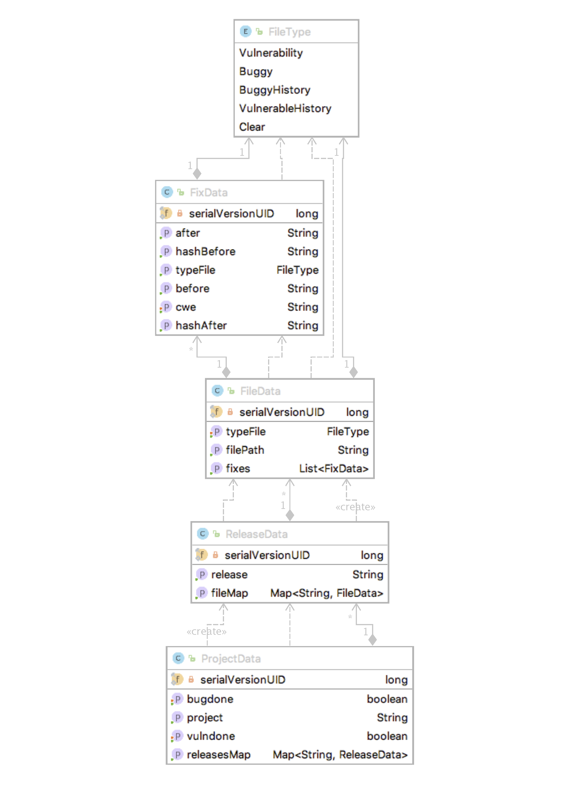

# Balancer Package

[](https://opensource.org/licenses/Apache-2.0)

## What is it?

The balancer package is the first mandatory process of the frameVPM framework.
It has two main functions. 
Firstly, the datasets generated by the data7 and the bug collector are organized around vulnerabilities and bugs which is perfect for analysis but less convenient for building predicition model. Indeed prediction model are aiming at categorising element of the source code, e.g., files, function,..., as either vulnerable or non vulnerable for example. Hence the dataset need to be reorganized around those elements of source code. Here it means, that the dataset are reorganized around files. Yet files have a temporality, i.e., they will be vulnerable at a time, then fixed, then maybe buggy and so on and so forth. Thus a model has to take this into account, a solution used by most of the approach to deal with this issue was to build model based on snapshot of a project like a release and only the category of the element of that time is kept. Hence the balancer package in addition to reorganize by file reorganize the data according to the release that were impacted by a bug or a vulnerability. 

Secondly, it prune the datasets from unwanted and/or redundant data. Indeed, both tool gather as much information as possible on vulnerabilities and bugs, but in some case information might be redundant, like two similar commit to fix a vulnerability on two different branches. On the other hand, some information are important for analysis but irrelevant for building a prediction model like commit containing tests to assure that regression is not possible.

## Requirements

To execute this package a serialized version of a vulnerability dataset and if chosen so a serialized version of a bug dataset is required.

## How does it work ?

### Dealing with the vulnerability set

#### Overview 

1. load the vulnerability dataset
2. for each vulnerability V stored
    1. for each fixing commit C starting by the most recent one:
        1. look for the closest release R to C
        2. for each file F modified by C
            1. create an entry for the file in all the release affected by V and mark them as vulnerable
            2. for the entry in R store the state of the file before and after the fix in addition
    
#### Heuristics 

Different heurisitcs are applied to avoid redundancy and irrelevant information

* Only one version of a repetitive commit is analysed (duplicate commit message)
* Only files of interest are kept,i.e, source files .c and .h that are not testing files
* When analysing a commit C fixing a vulnerability V, it is found that a file F was previously modified by one of the other commits CP fixing V then, instead of storing two fix for the file, the two file fix are merged into one, i.e., the entry will store the state of the file after fix of C and the state of file before fix of CP.

### Dealing with the bug set

In addition to the vulnerability set, the bug dataset can be taken into account.

1. load the bug dataset


## Dataset Structure
          
The dataset generated by the tool is only available through its binary serialized form and can be access through the following api:



## How to use the tools

1. you can install it with mvn install 
2. To call it from your code, just call 

```java 


``` 
    